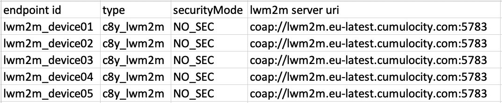
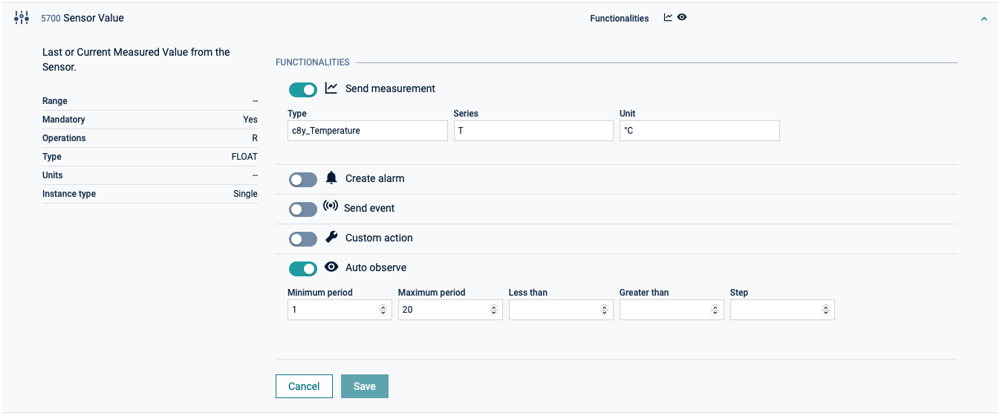

# Cumulocity LWM2M Demo client
This repository contains a demo implementation of the [eclipse Leshan client](https://github.com/eclipse/leshan) for **Cumulocity IoT**. The leshan client demo sends temperature values and supports location tracking and device controls. In the following it will be shown how to easily connect and use the demo client with Cumulocity IoT.

Cumulocity is an IoT platform that enables rapid connections of numerous different devices and applications. It allows you to monitor and respond to IoT data in real time and to spin up this capability in minutes. More information on Cumulocity IoT and how to start a free trial can be found [here](https://www.softwareag.cloud/site/product/cumulocity-iot.html#/).

Cumulocity IoT enables companies to quickly and easily implement smart IoT solutions.

The [Cumulocity IoT documentation](https://cumulocity.com/guides/protocol-integration/lwm2m/) contains detailed instructions on how to connect LWM2M devices to the platform.
______________________


For more information you can Ask a Question in the [TECHcommunity Forums](http://tech.forums.softwareag.com/techjforum/forums/list.page?product=webmethods-io-b2b).

You can find additional information in the [Software AG TECHcommunity](http://techcommunity.softwareag.com/home/-/product/name/webmethods-io-b2b).


______________________

These tools are provided as-is and without warranty or support. They do not constitute part of the Software AG product suite. Users are free to use, fork and modify them, subject to the license agreement. While Software AG welcomes contributions, we cannot guarantee to include every contribution in the master project.

Contact us at [TECHcommunity](mailto:technologycommunity@softwareag.com?subject=Github/SoftwareAG) if you have any questions.

## Getting started

Before the demo client can be connected to the platform, the endpoint and URI definition in the registration and docker-compose file need to be prepared for the bootstrap server configuration.

### registration.csv

In the registration.csv file, the fields for endpoint ID and lwm2m server URI must be checked. The endpoint ID is required by the bootstrap process in order to provision the LwM2M client with the bootstrap information. Make sure that the endpoint ID is unique and hasn’t been used before to register a device. Otherwise this will result in an error. Additionally, the lwm2m server uri needs to contain the right hosting environment: that you or rather your company is using. This should be one of the following public cloud instances: 
  - apj.cumulocity.com
  - cumulocity.com
  - eu-latest.cumulocity.com
  -	us.cumulocity.com
  -	emea.cumulocity.com

coap://lwm2m.**eu-latest.cumulocity.com**:5783

Your individual tenant prefix is not required since there is only one LwM2M server for each public cloud instance. 
Please note that this registration file is only applicable for the dedicated LwM2M bulk registration process that has been introduced with version 10.15. If you are still using an older version of Cumulocity IoT, use the template for the general bulk registration you can find in the [document](https://cumulocity.com/guides/10.14.0/users-guide/device-management/#creds-upload).





### docker-compose.yaml

Edit the docker-compose.yaml and change the endpoint ID and URI in the environment variables for all containers so that they match the entries in the registration file.

```
version: "4.3"
services:
  lwm2m_client_1:
    build:
      context: leshan-demo-client
      args:
        ENDPOINT: "lwm2m_device01" 
        URI: "lwm2m.eu-latest.cumulocity.com"
...
```

## Upload device protocols to Cumulocity IoT

LwM2M offers a predefined resource and data model that can also be extended to meet specific needs. Each object represents a certain functionality of the client and bundles all respective resources. This demo client uses the following LWM2M objects: 
  - 3 (device) 
  - 6 (location), 
  - 3303 (temperature sensor) 
  - 3441 (lwm2m test object)

Cumulocity allows any LWM2M objects to be easily interfaced with the platform and supports out-of-the-box integration for the standard LWM2M objects 3(device), 4(connectivity), 5(firmware) and 6(location).

In order to make use of the objects, a protocol definition for each object is required. You can find the protocol definitions as xml files in the resource folder. These need to be uploaded to your Cumulocity IoT tenant in the **Device Management -> Device types -> Device protocols** tab.


The demo client sends a random temperature measurement at 3303/5700 (object/resource). To activate the functionality, open the LWM2M Device Protocol with the name “3303 Temperature” and turn on **Send measurement** for the Sensor Value. Do also enable on **Auto observe** for at least one functionality per protocol. This will instruct the LWM2M device to periodically report data to Cumulocity IoT.



The LWM2M objects 3 (device) and 6 (location) are supported out-of-the-box and do not need a mapping configuration.

## Define LWM2M post-registration actions
LWM2M shell commands can be performed in the Shell tab of each device. It is also possible to execute some common operations when a device sends a full registration request.
In this example the LWM2M post operations will be used the read the current device info (3) and location (6) from the device, if the devices sends a registration request.
To do this go to the tab **Device Management -> Device types -> LWM2M post-operations** and add the following:
 ```
read /3
read /6
 ```


## Device registration

To register a LWM2M device in Cumulocity IoT, upload a CSV file with registration data in the bulk registration dialog in **Device Management -> Devices -> Registration -> Register device -> LWM2M (Bulk Registration)**.


After the regitstration process was succesfull, the new LwM2M demo devices will shown in the all device list in **Device Management -> Devices ->All devices**. 
The devices won’t show any incoming measurement values yet. First the demo client needs to be started. Do so by opening the folder in the Terminal and run the following command:

```
docker-compose up
```

Further information on how to read and send events, alarms or custom actions from LWM2M devices or how to write to LWM2M objects can be found in the [Cumulocity IoT documentation](https://cumulocity.com/guides/protocol-integration/lwm2m/).  
