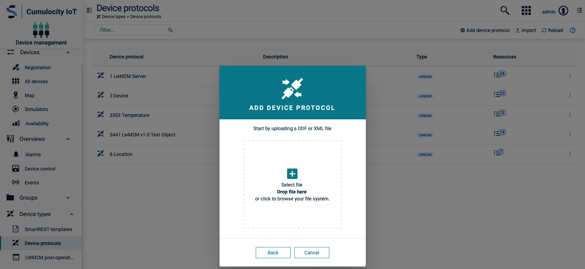

# Cumulocity LWM2M Demo client
Example implementation of the [eclipse Leshan client demo](https://github.com/eclipse/leshan) in **Cumulocity IoT**. The leshan client demo sends temperature values and supports location tracking and device controls. In the following it will be shown how to easily connect and use the demo client with Cumulocity IoT.

Cumulocity is an IoT platform that enables rapid connections of many, many different devices and applications. It allows you to monitor and respond to IoT data in real time and to spin up this capability in minutes. More information on Cumulocity IoT and how to start a free trial can be found [here](https://www.softwareag.cloud/site/product/cumulocity-iot.html#/).

Cumulocity IoT enables companies to quickly and easily implement smart IoT solutions.

The [Cumulocity IoT documentation](https://cumulocity.com/guides/protocol-integration/lwm2m/) contains detailed instructions on how to connect LWM2M devices to the platform.
______________________


For more information you can Ask a Question in the [TECHcommunity Forums](http://tech.forums.softwareag.com/techjforum/forums/list.page?product=webmethods-io-b2b).

You can find additional information in the [Software AG TECHcommunity](http://techcommunity.softwareag.com/home/-/product/name/webmethods-io-b2b).


______________________

These tools are provided as-is and without warranty or support. They do not constitute part of the Software AG product suite. Users are free to use, fork and modify them, subject to the license agreement. While Software AG welcomes contributions, we cannot guarantee to include every contribution in the master project.

Contact us at [TECHcommunity](mailto:technologycommunity@softwareag.com?subject=Github/SoftwareAG) if you have any questions.

## Getting started

Before the demo client can be connected to the platform, the endpoint and the URI of the bootstrap server must be configured.

### registration.csv

In the file registration.csv, the fields *ID*, *NAME*, *endpoint ID* and the field *lwm2m server URI* must be changed for each entry.
 


The fields *ID*, *NAME*, *endpoint ID* indicate the LWM2M client's "endpoint ID" to allow the LwM2M bootstrap to provision the bootstrap information for the LWM2M client. The endpoint ID has be **unique** across all tenants and must have the same value as the ID.

### docker-compose.yaml

Edit docker-compose.yaml and change the endpoint ID and URI in the environment variables for all containers.

```
version: "4.3"
services:
  lwm2m_client_1:
    build:
      context: leshan-demo-client
      args:
        ENDPOINT: "scf_lwm2m_test" 
        URI: "lwm2m.eu-latest.cumulocity.com"
...
```

## Upload device protocols to Cumulocity IoT

The leshan demo client uses the following LWM2M objects: 3 (device), 6 (location), 3303 (temperature sensor), 3441 (lwm2m test object).
Cumulocity allows any LWM2M objects to be easily interfaced with the platform. Cumulocity also supports out-of-the-box integration for the standard LWM2M protocols 3(device), 4(connectivity), 5(firmware) and 6(location).

Upload the xml resource files to Cumulocity in the **Device Management -> Device types -> Device protocols** tab.



The leshan demo client sends a random temperature measurement at 3303/5700. To add the functionality, open the 3303 protocol and turn on **Send measurement** for the Sensor Value. Make sure to enable on Auto observe for at least one functionality per protocol.


The LWM2M objects 3 (device) and 6 (location) don't need a mapping since the objects are supported out-of-the-box.

## Define LWM2M post-registration actions
LWM2M shell commands can be performed in the Shell tab of each device. It is also possible to execute some common operations when a device sends a full registration request.
In this example the LWM2M post operations will be used the read the current device info (3) and location (6) from the device, if the devices sens a registration request.
Therefor, go to the tab **Device Management -> Device types -> LWM2M post-operations** and add the following:
 ```
read /3
read /6
 ```

## Device registration

To register a LWM2M device in Cumulocity IoT, upload a CSV file with registration data in the bulk registration dialog in **Device Management -> Devices -> Registration -> Register device -> Bulk device**.


Start the demo clients with 

```
docker-compose up
```

Further information on how to read and send events, alarms or custom actions from LWM2M devices or how to write to LWM2M objects can be found in the [Cumulocity IoT documentation](https://cumulocity.com/guides/protocol-integration/lwm2m/).  
